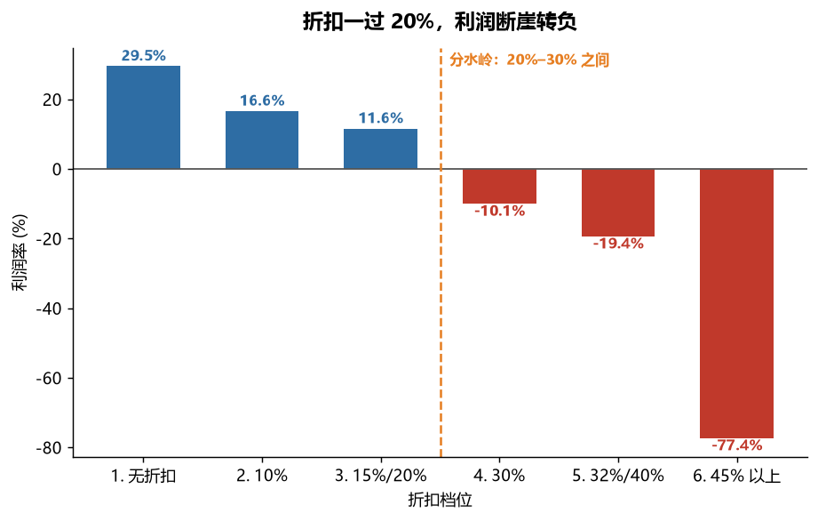
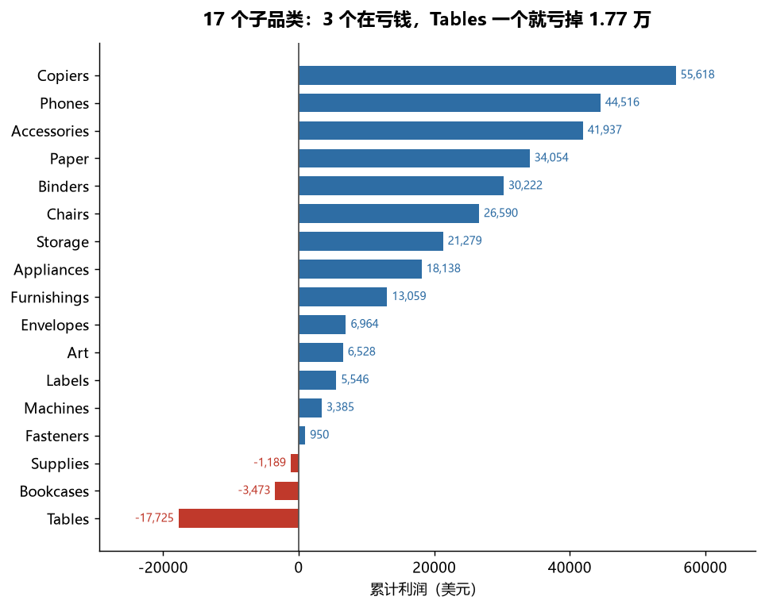
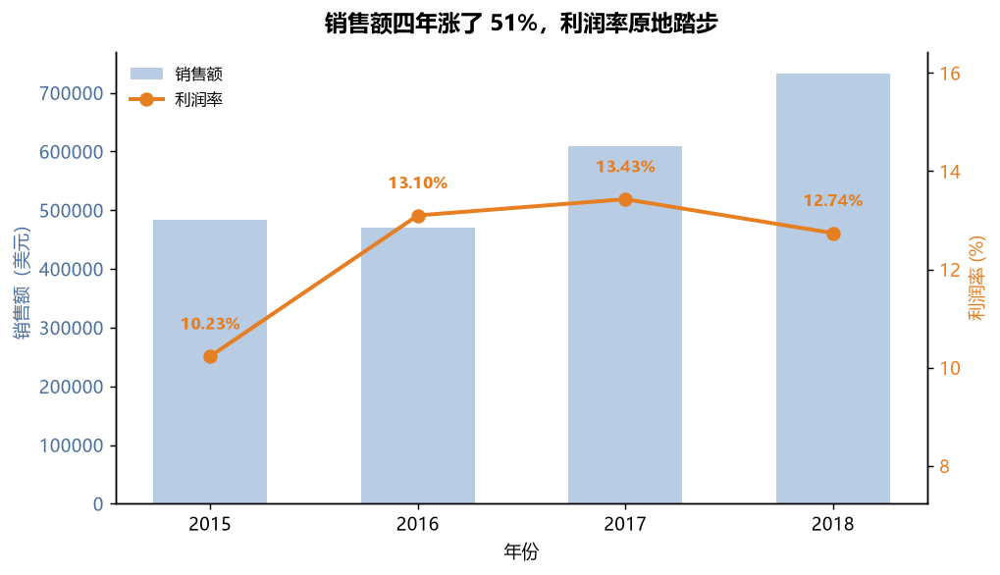

# Superstore 经营诊断：销售额涨了 51%，利润率为什么原地踏步？

用 SQL 对 4 年、5,009 笔零售订单做了一次利润归因分析，
找出了"增长质量差"的根因，并给出可执行的建议。

> **数据**：Tableau Sample Superstore，2015–2018，9,994 行
> **技术栈**：DuckDB（SQL 分析）· pandas · matplotlib · Python
> **完整结论**：见 [reports/findings.md](reports/findings.md)

---

## 核心结论（30 秒版）

**折扣一过 20%，利润断崖转负——分水岭位于 20%–30% 之间。**

| 折扣档位（真实取值） | 利润率 | 亏损订单占比 |
|---|---:|---:|
| 无折扣 | +29.51% | 0% |
| 15% / 20% | +11.58% | 14.0% |
| 30% | **−10.05%** | 91.6% |
| 45% 以上 | **−77.40%** | **100%** |

折扣 > 20% 的订单只占 13.9%，却造成 −13.5 万美元的利润损失——
**相当于全年利润的 47%**。同时销售额四年涨了 51%，利润率却始终停在 10%–13%。

## 三张图看懂全部分析

### 1. 折扣一过 20%，利润断崖转负



### 2. 三个产品线在出血，Tables 是最大出血点



### 3. 销售额涨了 51%，利润率原地踏步



## 这个项目展示了什么

**SQL 能力**（全部查询在 [`sql/`](sql/) 目录，每条带业务问题注释）：

- 分档聚合 + 条件聚合（`CASE WHEN`、`COUNT FILTER`）做折扣归因
- **条件聚合做区间拆分**：`SUM(x) FILTER (WHERE 条件)` 让一次扫描同时算出
  "折扣卡住前 / 后"两段利润（州级亏损拆解）
- **参数化扫描**：`VALUES` 构造参数表 + `CROSS JOIN`，一个查询算完全部阈值
  （阈值敏感性检验）
- 窗口函数：`RANK() OVER` 做子品类排名、`SUM() OVER` 做累计帕累托、
  `LAG()` 算同比增长率
- `SUM(x) OVER ()` 窗口合计代替子查询算销售占比
- 条件聚合实现行转列（客户细分 × 品类透视）

**数据工程意识**：

- raw → staging 两层建模：raw 层全字段按字符串原样入库（可随时重跑），
  staging 层显式做列名规范化和类型转换
- **日期格式坑**：源文件日期是 `11/8/2017` 美式格式，必须显式指定
  `%m/%d/%Y` 解析，否则按日/月/年误读后时间维度全错且不报错
- **数据源校验**：下载源文件实际混入了 Tableau 示例的另外两张工作表
  （People 4 行 + Returns 800 行），加载前按字段数校验剔除了 806 行
- 8 项数据质量校验（主键唯一性、空值、日期倒挂、取值越界、枚举域、订单粒度一致性），
  失败即中止流水线

**分析判断力**：每个结论都做了反向验证——
比如确认 Furniture 亏损不是"某类客户爱买便宜家具"造成的
（三类客户在 Furniture 上的利润率全部低于 3.5%）；
对最关键的"20% 阈值"做了敏感性检验，发现数据里 20%–30% 之间**没有任何订单**
（折扣只有 12 个离散档位），于是把结论从"20% 是分界线"修正为
"分水岭位于 20%–30% 之间，本数据无法进一步定位"；
还做了州一级的下沉，验证"卡折扣"这条建议在各州是否真的可落地。
并明确写出这份分析的 5 条局限（见 findings.md 第四节）。

## 快速开始

```bash
# 1. 安装依赖（建议在虚拟环境里）
pip install -r requirements.txt

# 2. 一键跑完整条流水线（数据已在仓库里，无需另外下载）
python run_all.py
```

跑完会在 `reports/` 下生成：

```
reports/
├── tables/    8 个分析查询的结果 CSV
└── figures/   3 张图表 PNG
```

也可以分步执行：

```bash
python -m src.load       # 装载 raw + staging 两层
python -m src.quality    # 跑 8 项数据质量校验
python -m src.analyze    # 执行 sql/ 目录下的全部查询，导出 CSV
python -m src.charts     # 生成图表
```

## 项目结构

```
superstore-analysis/
├── run_all.py                 # 一键跑通全流程
├── requirements.txt
├── data/
│   └── raw/superstore.csv     # 原始数据（已含 schema 校验，可复现）
├── sql/                       # 8 个分析查询，每条对应一个业务问题
│   ├── 01_overview.sql                整体经营 KPI
│   ├── 02_discount_impact.sql         ★ 折扣档位 vs 利润率（核心归因）
│   ├── 03_profit_by_subcategory.sql   子品类利润排名 + 累计帕累托
│   ├── 04_yearly_trend.sql            年度趋势 + 同比（LAG 窗口函数）
│   ├── 05_region_performance.sql      区域表现 + 加权折扣率
│   ├── 06_segment_by_category.sql     客户细分 × 品类透视
│   ├── 07_state_loss_split.sql        州级亏损拆解（条件聚合做区间拆分）
│   └── 08_threshold_sensitivity.sql   阈值敏感性检验（参数化扫描）
├── src/
│   ├── db.py                  # 路径常量与数据库连接
│   ├── fetch_data.py          # 数据下载 + schema 校验（记录了数据源陷阱）
│   ├── load.py                # raw → staging 两层装载
│   ├── quality.py             # 8 项数据质量校验
│   ├── analyze.py             # 执行 SQL 并导出结果
│   └── charts.py              # 生成 3 张图
└── reports/
    ├── findings.md            # ★ 完整分析备忘录（含建议与局限）
    ├── tables/                # 查询结果 CSV
    └── figures/               # 图表 PNG
```

## 数据说明

- 来源：Tableau 官方示例 Superstore 数据集（GitHub 公开镜像）
- 时间跨度：2015-01-03 ~ 2018-12-30
- 粒度：订单行（一行 = 一张订单里的一种商品），9,994 行 / 5,009 笔订单
- 关键字段：`Sales` 销售额、`Profit` 利润、`Discount` 折扣（0–0.8 小数）

> 已知数据源问题：GitHub 上的常见镜像把 Tableau 工作簿的
> Orders / People / Returns 三张表拼在了同一个 CSV 里。
> 本项目在 `src/fetch_data.py` 中按字段数校验剔除，只保留订单表。

## 数据来源与致谢

**数据来源。** 使用的 Sample Superstore 数据集由 Tableau 随产品公开发布，
用于教学与练习，本仓库通过 GitHub 公开镜像获取。数据集描述的是虚构的零售企业，
其中的客户、产品与订单均为示例数据。数据本身不属于本项目，本项目只做分析。
（说明：所引用的上游镜像仓库未附带 License 声明，此处按公开示例数据的学习用途引用，并在此注明出处。）

**关于分析的定位——请务必看这一段。** 「折扣侵蚀利润」是这个数据集**最常被讨论的标准课题**，
Tableau 官方教程与大量公开文章都做过类似分析。本项目**不是原创研究，也没有提出新发现**。
这一节写在这里，是为了避免任何误解：

- 本项目的价值在于**完整走通一条分析链路**——数据获取与校验 → 分层建模 → SQL 归因 → 可视化 → 结论与局限，
  并在这个过程中处理了两个真实的数据源问题（多表拼接污染、美式日期格式）；
- 在此基础上补充了两个**该课题常见的分析里不常做**的交叉验证：
  区域加权折扣率与利润率的对应关系、客户细分 × 品类的交叉（用于排除「某类客户爱买便宜家具」这一替代假设）；
- 结论中的具体数字由本项目在真实数据上计算得出，可通过 `python run_all.py` 复现；
  其中"折扣分水岭位于 20%–30% 之间"这一表述，是本项目在用敏感性检验复核
  该课题常见说法（"20% 是盈亏分界线"）时得出的修正——原说法把区间估计说成了点估计。

**代码与文档。** 本仓库的 SQL、Python 代码、README 与分析备忘录均为原创编写，
未复制或改写任何现有项目的源码；分析中引用的第三方库为 DuckDB、pandas、matplotlib。

**参考。** 数据集常见的公开镜像之一：
`leonism/sample-superstore`（GitHub）。同课题的公开分析文章较多，本项目未引用其代码。

